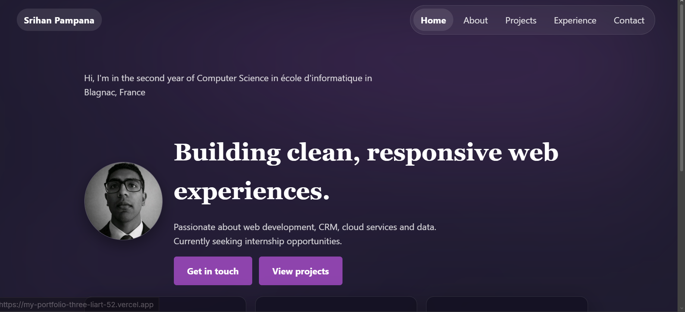

# My_Portfolio

A personal portfolio website built with React + Vite. It uses client-side routing for the main pages and a shared global stylesheet for a consistent look.

Live site: https://my-portfolio-three-liart-52.vercel.app

## Preview

## Tech stack

- React 18
- Vite 6 (build/dev server)
- React Router (page routing)
- CSS (single global stylesheet)
- Vercel (deployment)

## How it works

- Entry HTML: `index.html` mounts the app into `#root`.
- App bootstrap: `src/main.jsx` renders the React app.
- Routing: `src/App.jsx` defines the routes:
	- `/` → Home
	- `/about` → About
	- `/projects` → Projects
	- `/experience` → Experience
	- `/contact` → Contact
- Styling: `src/style.css` is imported once in `src/App.jsx`, so it applies to every page.

## Project structure

- `src/pages/` — route/page components (Home, About, Projects, Experience, Contact)
- `src/components/` — shared UI (Navbar, Footer)
- `src/assets/` — bundled assets imported from JS (e.g. profile image)
- `public/` — static files served as-is (e.g. `robots.txt`)

## Getting started

Prereqs: Node.js (LTS recommended)

- Install dependencies: `npm install`
- Start dev server: `npm run dev`
- Production build: `npm run build`
- Preview production build: `npm run preview`

## Contact form (Formspree)

The Contact page submits to Formspree.

- Default endpoint is hardcoded as a fallback in `src/pages/Contact.jsx`.
- To override it per-environment, set this environment variable:

`VITE_CONTACT_FORM_ACTION=https://formspree.io/f/yourformid`

Copy `.env.example` to `.env` and set the value. (Only variables prefixed with `VITE_` are exposed to the client.)

## Deployment + SEO

- SPA routing on Vercel is configured in `vercel.json` (serve real files first, then fall back to `index.html`).
- `public/robots.txt` is included so crawlers can fetch crawl rules.
- `index.html` includes a meta description and title.
